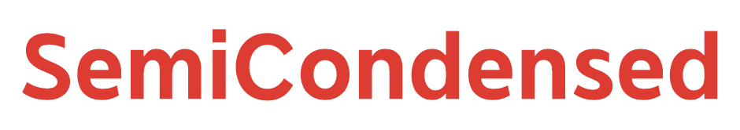
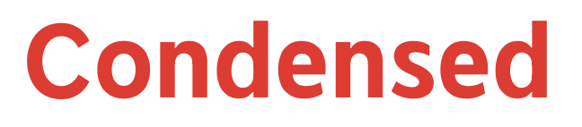
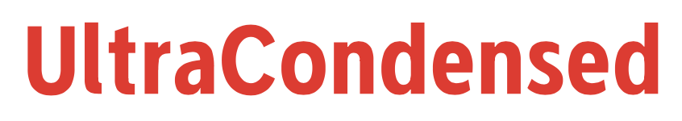

# The NeverMind Font Project

NeverMind, is a font family based on the logotype used by XMind. The Variable font family consists of 70 different font weights with stroker thickness from Thin 100 to Bold 700 and width from UltraCondensed 60 to Medium 100.It is geometric and humanist sans serif font, modern and friendly, and can be used for all types of communication.

## Fonts Details

* Supported languages

    Albanian, Basque, Catalan, Danish, Dutch, English, Estonian, Feroese, Finnish Scots, French, Gaelic, Galician, German, Greek Transliterated, Hungarian,     Icelandic, Indonesian, Irish, Italian, Nynorsk Bokmal Norwegian, Portuguese, Romanian, Slovak, Slovenian, Spanish, Swedish.

    Note: Catalan is not strictly supported by Latin Std fonts because of the Ldot. Dutch is not strictly supported by Latin Std fonts because of the IJ glyph.

* Version

    This is the first version of NeverMind Font Family - NeverMind Pro.

* Number of fonts

    Since NeverMind is OpenType STD fonts, you can actually generate millions of fonts by combine these three factors inside their range:  
    Slant: 0 -13 (represent italic)   
    Width:  60 -100   
    Weight: 100 - 700  

* Variable fonts

    OpenType variable fonts are an extension to the OpenType specification, included in OpenType 1.8. On 14 September 2016, Adobe, Apple Google, and Microsoft announced the technology, which allows a single font file to store a continuous range of design variants.

## Characters Examples 

## Style Examples
  

## Font Designer

The fonts were designed by XMind Designer Team leaded by designer Lan.  

## Usage

You can simply download fonts (.ttf files) and install to use. Some details and design info are included in pdf source file.

## LICENSE 

[SIL Open Font License.](LICENSE)

