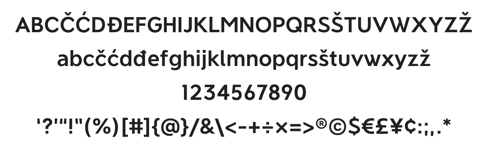
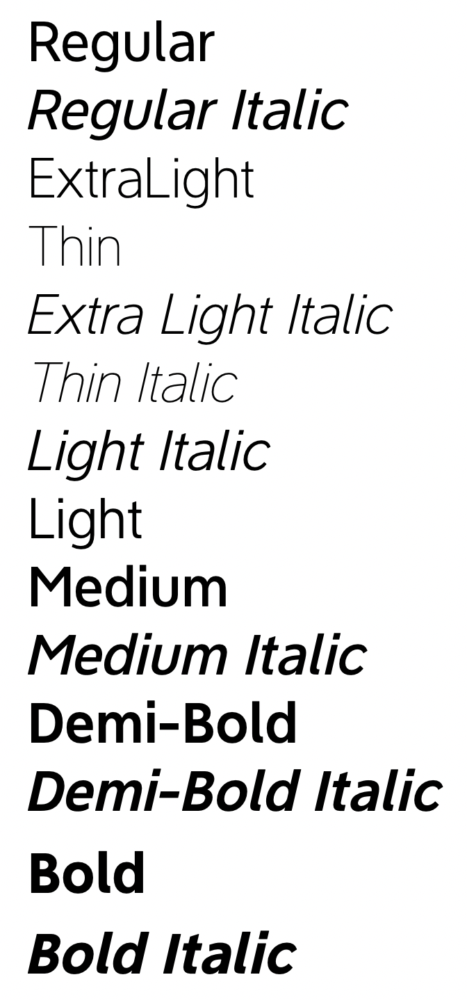
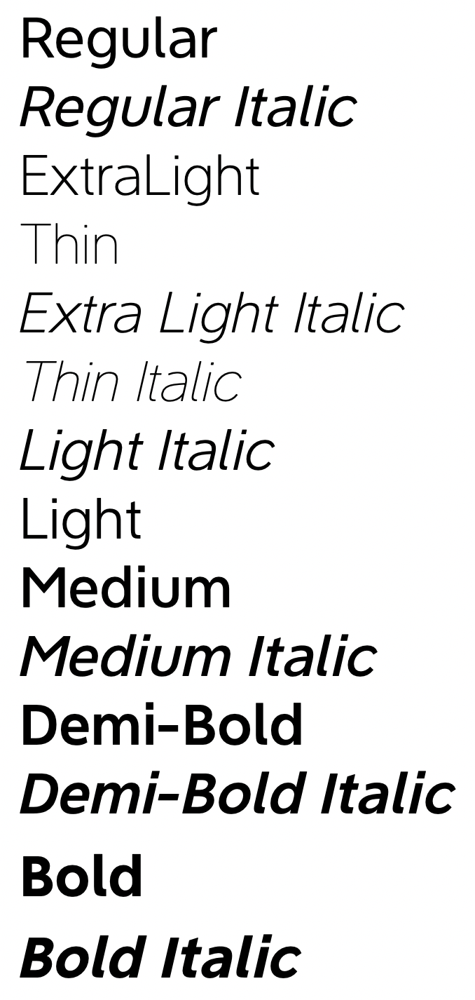

# The NeverMind Font Project

[NeverMind](https://www.behance.net/gallery/89046307/NeverMind), is a font family based on the logotype used and designed by [XMind](https://www.xmind.net/). It is geometric and humanist sans serif font, modern and friendly, and can be used for all types of communication.

## Font Details

* **Supported languages**

    Most Latin languages, including, but not limited to, Afrikaans, Basque, Breton, Catalan, Danish, Dutch, English, Finnish, French, Gaelic, German, Icelandic, Indonesian, Irish, Italian, Norwegian, Portuguese, Saami, Spanish, Swahili, Swedish.
    
    Note: Catalan is not strictly supported by Latin Std fonts because of the Ldot. Dutch is not strictly supported by Latin Std fonts because of the IJ glyph.

* **How many fonts**

    The font family consists of 28 different font weights with stroker thickness from Thin 100 to Bold 700 and two different widths (Condensed 90 and Medium 100).  

* **Font designer**  
    
    The fonts were designed by [XMind Designer Team](https://www.zcool.com.cn/u/18786155) led by designer Lan.

## Characters 

## Styles

* **Condensed** 

* **Medium**
  

  
## Usage

You can simply download fonts (.ttf files) and install to use.

## LICENSE 

[SIL Open Font License.](LICENSE)

