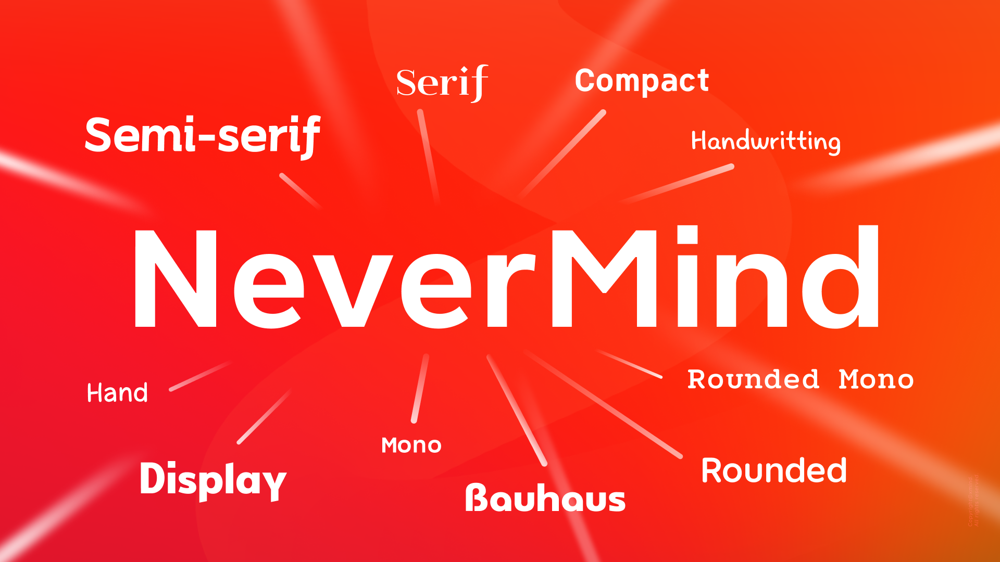

# The NeverMind Font Family

[NeverMind](https://www.behance.net/gallery/89046307/NeverMind) is the brand font of Xmind. It is a font family based on the logotype used and designed by [Xmind](https://www.xmind.net/). It is geometric and humanist font, modern and friendly, and can be used for all types of communication. It is a available in 10 weights (100-1000) and supports 109 languages including German, French, Greek and Russian.
    
This font family currently includes one basic typeface and more than ten different fonts in various styles, including round, handwritten, serif, slab and so on.

## Font Details

* **All Fonts**

    The font family contains all following fonts：

  [**NeverMind**](https://www.behance.net/gallery/89046307/NeverMind)                       
                       
  **NeverMind family**  

      NeverMind UltraCondensed             
      NeverMind ExtraCondensed         
      NeverMind Condensed              
      NeverMind SemiCondensed            
      NeverMind SemiExtended              
      NeverMind Extended                   
      NeverMind ExtraExtended              
      NeverMind UltraExtended              
      NeverMind Headline                  

      NeverMind Compact             
      NeverMind Display              
      NeverMind Hand                 
      NeverMind Handwritting         
      NeverMind Rounded Mono        
      NeverMind Mono                 
      NeverMind Rounded             
      NeverMind semi-serif           
      NeverMind New Serif            
      NeverMind Slab                
      NeverMind Bauhaus             
      NeverMind Pixel 

* **Supported languages**

    Most Latin languages, including, but not limited to, Afrikaans, Basque, Breton, Catalan, Danish, Dutch, English, Finnish, French, Gaelic, German, Icelandic, Indonesian, Irish, Italian, Norwegian, Portuguese, Saami, Spanish, Swahili, Swedish, russian and more over 100 languages.
    
    Note: Catalan is not strictly supported by Latin Std fonts because of the Ldot. Dutch is not strictly supported by Latin Std fonts because of the IJ glyph. Except for NeverMind, other fonts do not support Greek, Russian, icons, nor a series of opentye attributes.
  
* **Font designer**  
    
    The fonts were designed by [Xmind Designer Team](https://www.zcool.com.cn/u/18786155).

## Styles

  
## Usage

You can simply download fonts resource files and install to use.

## LICENSE 

[SIL Open Font License.](LICENSE)

