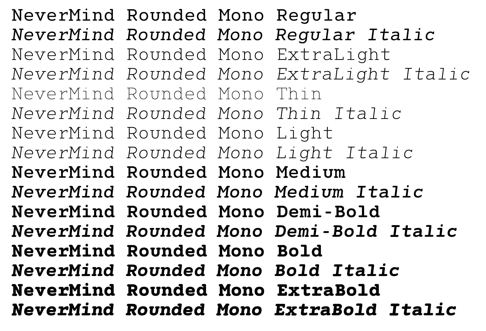

# The NeverMind Font Family

[NeverMind](https://www.behance.net/gallery/89046307/NeverMind), is a font family based on the logotype used and designed by [Xmind](https://www.xmind.net/). It is geometric and humanist font, modern and friendly, and can be used for all types of communication.    
    
This font family currently includes one basic typeface and five other different fonts in various styles, including round, handwritten, serif, and sans serif. More fonts may be added in the future.

## Font Details

* **All Fonts**

    The font family contains the following six fonts：
    1. [NeverMind](https://www.behance.net/gallery/89046307/NeverMind)
    2. NeverMind Rounded
    3. NeverMind Rounded Mono
    4. NeverMind Hand
    5. NeverMind serif
    6. NeverMind semi-serif

* **Supported languages**

    Most Latin languages, including, but not limited to, Afrikaans, Basque, Breton, Catalan, Danish, Dutch, English, Finnish, French, Gaelic, German, Icelandic, Indonesian, Irish, Italian, Norwegian, Portuguese, Saami, Spanish, Swahili, Swedish.
    
    Note: Catalan is not strictly supported by Latin Std fonts because of the Ldot. Dutch is not strictly supported by Latin Std fonts because of the IJ glyph.
  

* **Font designer**  
    
    The fonts were designed by [XMind Designer Team](https://www.zcool.com.cn/u/18786155).

## Styles

* **NeverMind** 

* **NeverMind Rounded**

* **NeverMind Rounded Mono**

* **NeverMind Hand**

* **NeverMind Serif**

* **NeverMind semi-serif**

  
## Usage

You can simply download fonts resource files and install to use.

## LICENSE 

[SIL Open Font License.](LICENSE)

